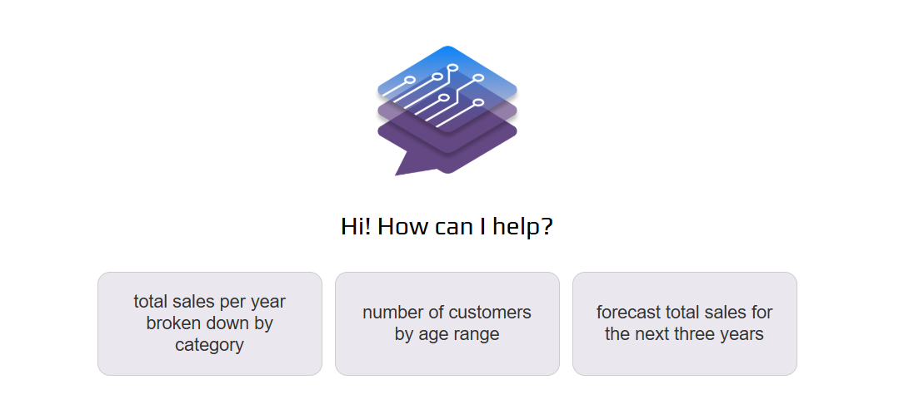
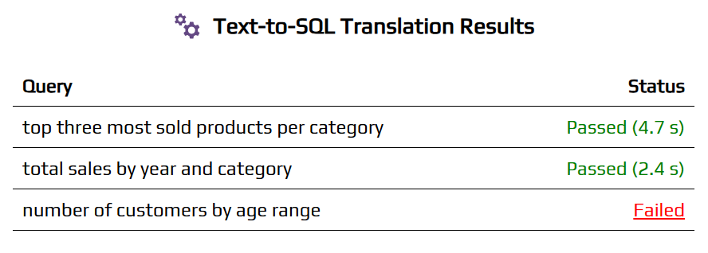
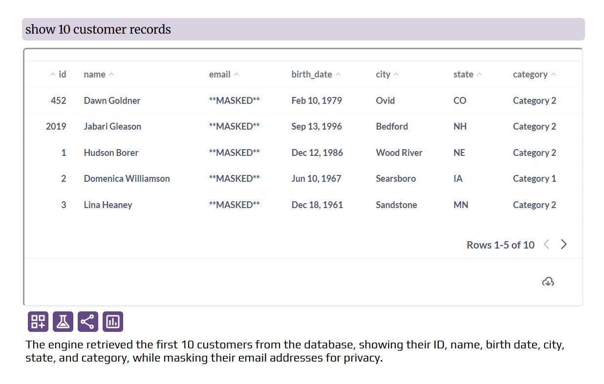

# Admin Panel Overview

### Database Connections

This is where you connect your database(s), manage table-level permissions for each database, and can provide business metrics and descriptions for databases, tables and columns.

### LLM Config

Here you can configure different features for LLM. 
<!-- One important feature is **web search**. When web search is enabled, user queries that cannot be answered by database data, would be answered by web search. -->

### App Access Management

- **New Users Must be Granted Access Manually**: If this settings is disabled, when a user creates an account and verify their email, they can login to the app.
If this settings is enabled, when a user creates an account and verify their email, they still cannot login to the app until an admin grants them access manually in Admin Panel > User Management.
- **Only Certain Email Domains Can Create an Account**: If this setting is enabled, only the email domains that you specify can create an account. This would only affect the new signups.

### User Management

- **User Groups**:
You can create user groups and view the list of members for each group. There are two built-in groups: "Admins" and "Default".
    - When users sign up, they are automatically assigned to the "Default" group.
    - You can promote a user to admin by adding them to the "Admins" group.
- **User Group Assignment and Access Management**
You can grant or revoke access to the app for each user and assign groups to them. In Sealed Intelligence, groups are used to manage table-level access; Users are assigned to groups, and groups are granted access to tables.
- **Custom User Attributes**
You can create custom user attributes. These attributes can be used in the following two ways to make sure users see only what they are supposed to see:
    - For defining row-level access control
    - For auto-filtering dashboards in "Dashboards + Chatbot Layout". These filters would be "locked" filters, meaning the users would not be able to see or change these filters.

### Email Setup

The email setup is required for email user sign-up and password-reset functionality.

### Default Language for All Users

You can set the default language which would apply to new users. Each user can set their own language preference in Settings > Language. The language would affect voice transcription, chatbot responses, and action buttons.

### Query Suggestions

<figure markdown="1">
{ width="600" }
</figure>

In this section, you can define sample queries to be displayed on the homepage. This will greatly help new users understand the types of questions they can ask.

### Text-to-SQL Translation Tests

<figure markdown="1">
{ width="600" }
</figure>

In this section, you can define test cases along with their expected SQL query. You can then run these tests to verify if they all pass. If a test fails, you can see the reason for the failure. You can modify the semantic layer and metadata (business metrics, descriptions of the database, tables, and fields) in  `Admin Panel > Database Connections > [DB Name] > Semantic Layer and Metadata Management` accordingly to fix the errors and run the tests again.

### Integration with BI Tools

!!! note

    Currently only **Metabase** is supported for BI integration. If you need integration with other BI tools, let us know.

Connecting Sealed Intelligence to your BI tool allows you to

- Use the database connections defined in your BI tool for Sealed Intelligence (instead of manually adding a database connection)
- Use the dashboards created in your BI tool as a data source for answering questions in Sealed Intelligence
- Use the 'Dashboards + Chatbot' layout (explained below)

When the 'Dashboards + Chatbot' layout is enabled, after user login, the dashboards that the user has access to would be shown (plus a dashboard picker for switching between dashboards), and Sealed Intelligence would be shown as a widget in bottom-right corner of screen. This format is ideal for **customer-facing analytics**, e.g. if you are sharing one or more dashboards with your customers.

 
By clicking the widget, the chat interface becomes visible.
 
 

In "Dashboard + Chatbot Interface" tab, you can specify which dashboards should be available to each user group. For each dashboard id mentioned here, you need to enable embedding for it in Metabase (Top-right section of dashboard > Sharing > Embed > Static Embedding > Publish). If that option is not available, it means you haven't enabled static embedding in your Metabase instance (Admin Panel > Settings > Embedding).

You can also associate user attributes with dashboard filters so the dashboards are automatically filtered (locked filters) using the user attribute value. This ensures users only access the data they are meant to see. You need to:

- Enable "Auto-Filter Dashboards by User Attributes" in Sealed Intelligence Admin Panel > BI Integration > 'Dashboards + Chatot Interface'
- Create a filter in your Metabase dashboard with the same name as the user attribute.
- Tie the filter to relevant cards of the dashboard. 
- In [Top-right section of dashboard > Sharing > Embed > Static Embedding > Parameters] make the filter "Editable" and publish.

### Row-level Security (RLS)

While the Database Connections tab manages table-level access for user groups, this section allows you to manage row-level access for user groups.

### Data Obfuscation

You can specify which columns' data should be obfuscated for each user group. Obfuscation is done using dynamic data masking. In other words, the mask is dynamically applied on the specified column(s) without the need to hard-code it in your database.

### White-Labeling

In this section you can replace the Sealed Intelligence name and logo, and provide your own demo link (which will be shown to new users).

The configurations in this section will take effect only if white-labeling is enabled in your license key.

### Compliance

If you are using this app in a customer-facing environment and some of your customers require that their chats not be stored in your database, you can provide their email domains below (comma-separated). 

