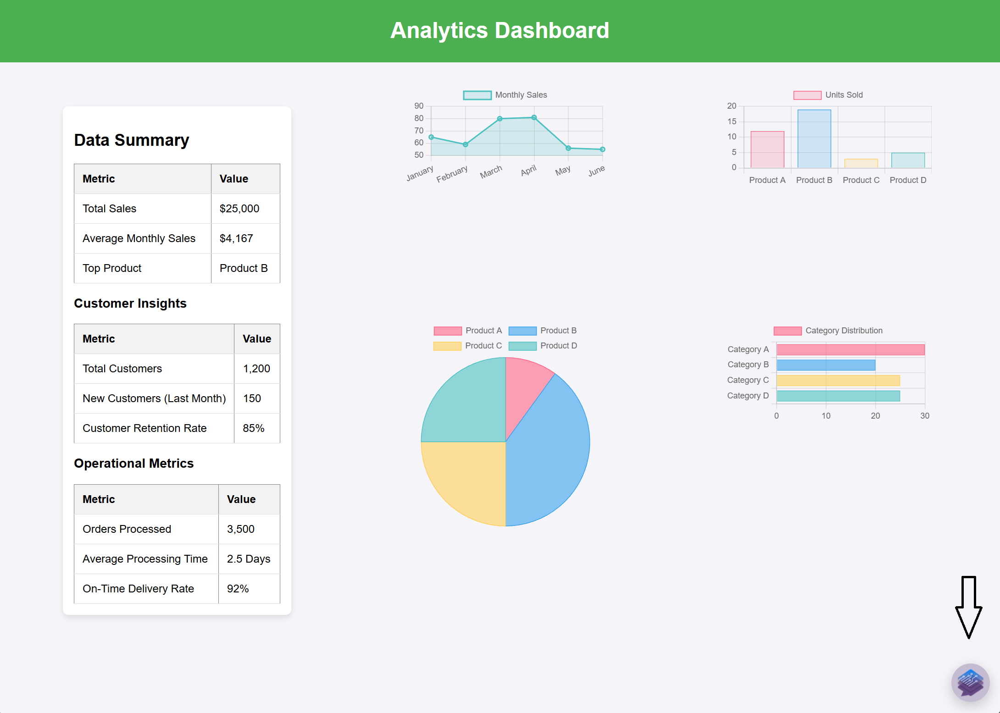
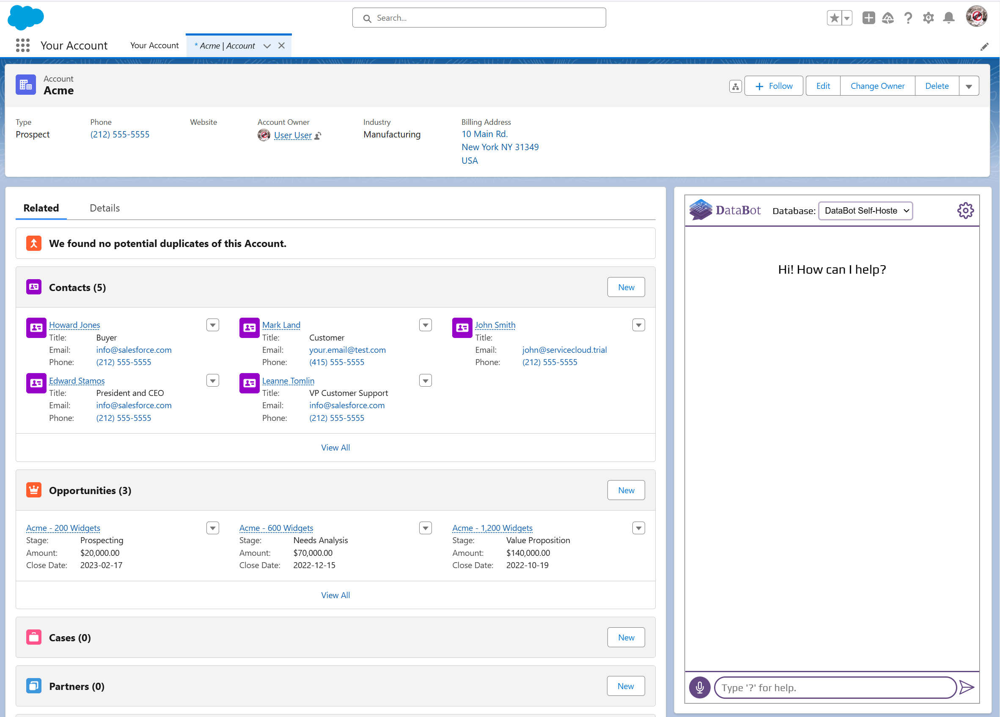

# Embedding 

In addition to using Sealed Intelligence in a dedicated webpage—either with just the chatbot or [with both the chatbot and dashboards](./admin_panel_overview.md#bi-integration)—you can also embed it directly into a website or app, as follows:

### Embedding as a Widget
If you control the platform where you want to place Sealed Intelligence, adding it as a widget is the most seamless option. It delivers a native feel and integrates directly with your environment.

- Download `sealed-intelligence-widget.js` from [here](https://sealedintelligence.com/files/sealed-intelligence-widget.js).
- Optionally modify it by changing colors, etc.
- Include the following code snippet in the frontend of your app or website.

```html
<script
  src="sealed-intelligence-widget.js"
  defer
  app-url="[Sealed Intelligence URL]/?is-widget=true"
></script>
```



### Embedding as an iframe
If you do not control the platform where you want to place Sealed Intelligence, such as a CRM or third party tool, embedding it as an iframe is the simplest way to integrate Sealed Intelligence within that tool.

```html
<iframe src="[Sealed Intelligence URL]" allow="microphone"></iframe>
```

### Single Sign-On (SSO)
Whether you embed Sealed Intelligence as a widget or an iframe, SSO lets you authenticate users through your existing identity provider. This removes the need for a separate Sealed Intelligence login and creates a smooth experience.

Simply use the following code to generate a jwt everytime the page containing embedded Sealed Intelligence loads, and use it in the embedding URL:

```py
import jwt
import time

SI_AUTH_KEY = ***  # this is the environment variable you provided 
                   # when deploying Sealed Intelligence

jwt_payload = {
    "sub": "user@example.com",     # replace with the actual user email
    "iat": int(time.time()),
    "exp": int(time.time()) + 30,  # expires in 30 seconds

    # Optional
    "group_memberships": ['Admins'],
    "custom_user_attribute_assignments": {  
        "attr1": "12345",  # example key-value 
        "attr2": "abcd",   # example key-value
    }
}

# Sign the JWT
jwt_token = jwt.encode(jwt_payload, SI_AUTH_KEY, algorithm="HS256")
```
You would then use the token to build the URL used in the widget or iframe:

```html
<script
  src="sealed-intelligence-widget.js"
  defer
  sealed-intelligence-url="[Sealed Intelligence URL]/sso/login?is-widget=true&token=[jwt_token]"
></script>
```
```html
<iframe src="[Sealed Intelligence URL]/sso/login?token=[jwt_token]" allow="microphone"></iframe>
```

You can control user access levels by specifying the `group_memberships` and `custom_user_attribute_assignments` parameters.

- `group_memberships` defines which tables or views a user can access.
- `custom_user_attribute_assignments` is used to manage access at row level. When BI integration is enabled, it's also used for managing access to dashboard cards (both when viewing dashboards and when using dashboard cards as data source).


### Embedding in Salesforce

The easiest way to embed Sealed Intelligence as an iframe inside Salesforce is using a Visualforce Page:
```html
<apex:page showHeader="false" applyBodyTag="false" applyHtmlTag="false">
    <iframe 
        src="[iframe url]" 
        width="99%" 
        height="800" 
        allow="microphone"
        style="border: 1.5px groove #ccc;">
    </iframe>
</apex:page>
```


